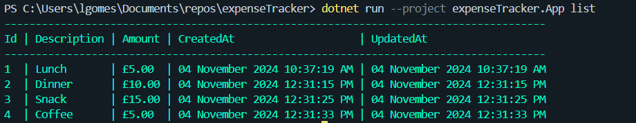

<div align="center" id="top">
&#xa0;
  <!-- <a href="https://expensetracker.netlify.app">Demo</a> -->
</div>

<h1 align="center">ExpenseTracker</h1>

<p align="center">
  

  

  

</p>


<!-- Status -->

<!-- <h4 align="center">
	🚧  ExpenseTracker 🚀 Under construction...  🚧
</h4>

<hr> -->

<p align="center">
  <a href="#dart-about">About</a> &#xa0; | &#xa0;
  <a href="#sparkles-features">Features</a> &#xa0; | &#xa0;
  <a href="#rocket-technologies">Technologies</a> &#xa0; | &#xa0;
  <a href="#white_check_mark-requirements">Requirements</a> &#xa0; | &#xa0;
  <a href="#checkered_flag-starting">Starting</a> &#xa0; | &#xa0;
  <a href="#memo-license">License</a> &#xa0; | &#xa0;
  <a href="https://github.com/lucaas27" target="_blank">Author</a>
</p>

<br>

## :dart: About

Expense Tracker is a simple CLI application to manage your expenses. It allows you to add, update, delete, list, and summarize your expenses.

The expenses are stored in a json file by default but can be exported as csv or txt.

It is a challenge from roadmap.sh.

Project Task URL : https://roadmap.sh/projects/expense-tracker

## :sparkles: Features

:heavy_check_mark: Add a new expense;\
:heavy_check_mark: Update an existing expense;\
:heavy_check_mark: Delete an expense;\
:heavy_check_mark: Delete all expenses;\
:heavy_check_mark: List all expenses;\
:heavy_check_mark: Show a summary of all expenses;\
:heavy_check_mark: Show a summary of expenses in a month;
:heavy_check_mark: Export expenses as a CSV or TXT file;

## :rocket: Technologies

The following tools were used in this project:

- [.NET 8.0](https://dotnet.microsoft.com/download/dotnet/8.0)

## :white_check_mark: Requirements

Before starting :checkered_flag:, you need to have installed:

1.  [Git](https://git-scm.com)
2.  [.NET 8.0 SDK](https://dotnet.microsoft.com/download/dotnet/8.0)
3.  Code Editor: A code editor like Visual Studio Code or Visual Studio.

## :checkered_flag: Starting

```bash
# Clone this project
$ git clone https://github.com/lucaas27/expensetracker

# Access
$ cd expensetracker

# Restore dependencies
$ dotnet restore

# Build the project
$ dotnet build

# Run the project
$ dotnet run --project expenseTracker.App [command] [options]

```

### Commands

`add`: Add a new expense\
`update`: Update an existing expense\
`delete`: Delete an expense\
`list`: List all expenses\
`summary`: Show a summary of all expenses\
`export`: Export all expenses to a file\
`help`: Show help

### Options

`--description`: Description of the expense\
`--amount`: Amount of the expense\
`--id`: ID of the expense\
`--month`: Month of the expense\
`--csv | --txt | --json`: Used to specify the format to export expenses to\
`--all`: Used to delete all expenses

### Examples

1. Add a new expense:

```bash
dotnet run --project expenseTracker.App add --description "Coffee" --amount 2.50
```

2. Update an existing expense:

```bash
dotnet run --project expenseTracker.App update --id 1 --description "Water"
dotnet run --project expenseTracker.App update --id 1 --amount 2
dotnet run --project expenseTracker.App update --id 1 --amount 5.50 --description "Lunch"
```

1. Delete an expense:

```bash
dotnet run --project expenseTracker.App delete --id 1
dotnet run --project expenseTracker.App delete --all
```

4. List all expenses:

```bash
dotnet run --project expenseTracker.App list
```

5. Show a summary of all expenses:

```bash
dotnet run --project expenseTracker.App summary
dotnet run --project expenseTracker.App summary --month 1
```

6. Export expenses to a file:

```bash
dotnet run --project expenseTracker.App export  # It will export expenses to a csv by default
dotnet run --project expenseTracker.App export --json
dotnet run --project expenseTracker.App export --csv
dotnet run --project expenseTracker.App export --txt
```

7. Show help:

```bash
dotnet run --project expenseTracker.App help
```

## :memo: License

This project is under license from MIT. For more details, see the [LICENSE](LICENSE) file.

Made by <a href="https://github.com/lucaas27" target="_blank">Lucas Gomes</a>

&#xa0;

<a href="#top">Back to top</a>
